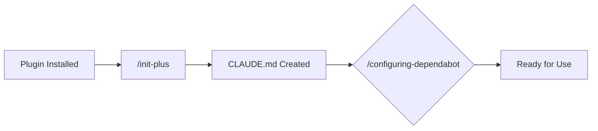

# 🪙 Token Effort

> Low-stakes intelligence for high-latency humans

A collection of Claude Code agents and skills that do just enough to avoid being replaced by a shell script.

## 🚀 Getting Started

```bash
claude plugin marketplace add HeadlessTarry/Token-Effort
claude plugin install token-effort@token-effort
```

Skills become `/token-effort:triaging-gh-issues`, `/token-effort:computing-branch-diff`, etc.

## 📚 Documentation Index

### 🎯 Skills

| Skill | Purpose |
|-------|---------|
| [brainstorming-gh-issue](plugins/token-effort/skills/brainstorming-gh-issue/SKILL.md) | Brainstorm GitHub issues, create design specs, refine ideas |
| [building-gh-issue](plugins/token-effort/skills/building-gh-issue/SKILL.md) | Implement issues end-to-end from spec to merged PR |
| [computing-branch-diff](plugins/token-effort/skills/computing-branch-diff/SKILL.md) | Compute changes between branches for reviews and analysis |
| [configuring-dependabot](plugins/token-effort/skills/configuring-dependabot/SKILL.md) | Configure Dependabot for automated dependency updates |
| [init-plus](plugins/token-effort/skills/init-plus/SKILL.md) | Interactive repository setup with CLAUDE.md and workflows |
| [move-issue-status](plugins/token-effort/skills/move-issue-status/SKILL.md) | Move issues between project board statuses |
| [planning-gh-issue](plugins/token-effort/skills/planning-gh-issue/SKILL.md) | Write implementation plans for approved GitHub issues |
| [propose-feature](plugins/token-effort/skills/propose-feature/SKILL.md) | File new feature requests through guided interview |
| [recording-decisions](plugins/token-effort/skills/recording-decisions/SKILL.md) | Record Architecture Decision Records (ADRs) in docs/decisions |
| [report-bug](plugins/token-effort/skills/report-bug/SKILL.md) | File new bug reports through guided interview |
| [reviewing-code-systematically](plugins/token-effort/skills/reviewing-code-systematically/SKILL.md) | Perform comprehensive code reviews on branches or main |
| [triaging-gh-issues](plugins/token-effort/skills/triaging-gh-issues/SKILL.md) | Triage open issues: label and correct issue labels |

### 🤖 Agents

| Agent | Purpose |
|-------|---------|
| [agent-creator-engineer](plugins/token-effort/agents/agent-creator-engineer.md) | Create new or improve existing Claude Code agent definitions |
| [reviewer-dead-code](plugins/token-effort/agents/reviewer-dead-code.md) | Review files for dead code, unused symbols, and stale flags |
| [reviewer-docs](plugins/token-effort/agents/reviewer-docs.md) | Review documentation for quality and accuracy |
| [reviewer-newcomer](plugins/token-effort/agents/reviewer-newcomer.md) | Review source for clarity, comments, and assumptions |
| [skill-creator-engineer](plugins/token-effort/agents/skill-creator-engineer.md) | Create new or improve existing skill definitions |

### 🪝 Hooks

Hooks configure automation triggers in [plugins/token-effort/hooks/hooks.json](plugins/token-effort/hooks/hooks.json).

## 🔄 Workflows

Three common workflows through the plugin ecosystem:

### Repository Initialization



### Feature Development

```mermaid
graph LR
    A["Feature Idea"] --> B["/propose-feature"]
    B --> C["📋 New"]
    C --> D["/triaging-gh-issues"]
    D --> E["🧠 Brainstorming"]
    E --> F["/brainstorming-gh-issue"]
    F --> G["📐 Planning"]
    G --> H["/planning-gh-issue"]
    H --> I["🏗️ Building"]
    I --> J["/building-gh-issue + agents"]
    J --> K["✅ Done"]
```



### Bug Fix

```mermaid
graph LR
    A["Bug Found"] --> B["/report-bug"]
    B --> C["📋 New"]
    C --> D["/triaging-gh-issues"]
    D --> E["🧠 Brainstorming"]
    E --> F["/brainstorming-gh-issue"]
    F --> G["📐 Planning"]
    G --> H["/planning-gh-issue"]
    H --> I["🏗️ Building"]
    I --> J["/building-gh-issue + agents"]
    J --> K["✅ Done"]
```



## 🏗️ Structure

```
plugins/token-effort/
├── agents/      →  agent definitions
├── skills/      →  skill definitions
└── hooks/       →  hooks + hook declarations

.claude/skills/run-training/   →  local skill (training evals live in this repo)

training/
└── <type>/<name>/   →  eval cases for the /run-training skill

docs/
└── *.md             →  guides and reference docs
```

## 🧪 Training

Skills and agents in this repo can be iteratively improved using the `/run-training` skill, which evaluates definitions against committed test cases and proposes targeted mutations to improve them.

See [docs/training-guide.md](docs/training-guide.md) for the full guide.

## 🏷️ Releases

New versions are published via the [release workflow](.github/workflows/release.yml). Trigger it manually in GitHub Actions with a SemVer version string — it patches `plugin.json`, tags the commit, and creates a GitHub release.

## ➕ Adding Things

Agents go in `plugins/token-effort/agents/<name>.md`. Skills go in `plugins/token-effort/skills/<name>/SKILL.md`. See existing entries for reference.
