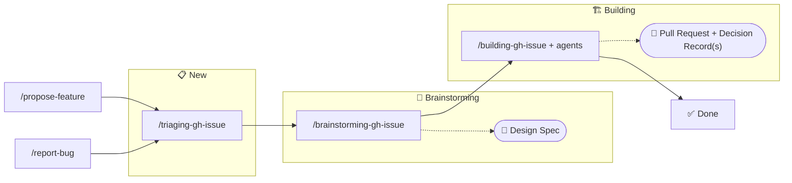

# 🪙 Token Effort

> Low-stakes intelligence for high-latency humans

A collection of OpenCode skills and agents that do just enough to avoid being replaced by a shell script.

[](https://sonarcloud.io/summary/new_code?id=HeadlessTarry_Token-Effort)

## Prerequisites

- [gh CLI](https://cli.github.com/) — authenticated with `gh auth login`
- [jq](https://jqlang.github.io/jq/download/) — JSON parsing

## Installation

```bash
git clone https://github.com/HeadlessTarry/Token-Effort.git
cd Token-Effort
```

**PowerShell (Windows):**
```powershell
.\install.ps1
```

**Bash (Linux/macOS/WSL):**
```bash
./install.sh
```

Both scripts sync `skills/` and `agents/` into your OpenCode config directory. Restart OpenCode to pick up changes.

**Options:**

| Flag (PS) | Flag (Bash) | Description |
|-----------|-------------|-------------|
| `-Skill <name>` | `--skill <name>` | Install only the specified skill |
| `-Agent <name>` | `--agent <name>` | Install only the specified agent |
| `-Local` | `--local` | Install to `.opencode/` in the project directory instead |

## Directory Structure

```
skills/          → OpenCode skill definitions
agents/          → OpenCode agent definitions
pending-migration/ → Legacy content (DO NOT MODIFY — will be removed)
```

## Workflows

### Feature Development & Bug Fix Workflow



Issue states (📋 New, 🧠 Brainstorming, 📐 Planning, 🏗️ Building, ✅ Done) correspond to GitHub Project board columns. Each skill automatically advances the issue from an earlier status.

## Migration Status

This repo is migrating from a Claude Code plugin to native OpenCode skills and agents. The `pending-migration/` directory contains legacy content that will be removed once migration is complete. Do not modify or add to it.
