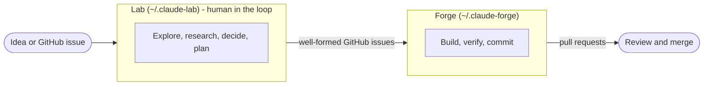

# 🪙 Token Effort

> Low-stakes intelligence for high-latency humans

A personal AI toolkit. It sets up two isolated agent areas for Claude Code so several sessions can run in parallel without babysitting each one.

[](https://sonarcloud.io/summary/new_code?id=HeadlessTarry_Token-Effort)

## 🧭 The two areas

| Area | Purpose | Output | Third-party skills |
|------|---------|--------|--------------------|
| **Lab** | Explore an idea or issue, research, decide, plan. Human-in-the-loop | Well-formed GitHub issues | [`mattpocock/skills`](https://github.com/mattpocock/skills) |
| **Forge** | Turn actionable issues into quality PRs | Pull requests | [`michael-denyer/pstack-claude`](https://github.com/michael-denyer/pstack-claude) |


```mermaid
flowchart LR
    idea([Idea or GitHub issue]) --> lab
    subgraph lab ["Lab (~/.claude-lab) - human in the loop"]
        explore[Explore, research, decide, plan]
    end
    lab -->|well-formed GitHub issues| forge
    subgraph forge ["Forge (~/.claude-forge)"]
        build[Build, verify, commit]
    end
    forge -->|pull requests| review([Review and merge])
```

Each area is a separate `CLAUDE_CONFIG_DIR` (`~/.claude-lab`, `~/.claude-forge`), so skills, plugins, settings, credentials and memory never leak between them. Nothing is installed into repos, and your default `~/.claude` is left alone.

Home-grown skills in `skills/`:

| Skill | Lab | Forge |
|-------|:---:|:-----:|
| `propose-feature` | ✅ | |
| `report-bug` | ✅ | |
| `disclose-ai-content` | ✅ | ✅ |
| `configuring-dependabot` | | ✅ |

## ⤵️ Installation

```bash
./install.sh
```

Re-run it any time to update. It is safe to repeat; your answers are remembered in `~/.claude-<area>/.install-state`.

| Flag | Effect |
|------|--------|
| `--persona-lab <name>` / `--persona-forge <name>` | Pick `Default` or a persona from `personas/` for that area |
| `--ide <none\|zed>` | Configure IDE agents (Zed adds "Lab" and "Forge") |
| `--reconfigure` | Ask every question again |

Each area gets a starter `permissions` block from `areas/<area>/settings.json`. Re-runs add any new entries and keep your own; entries you remove from an area will come back, so edit `areas/<area>/settings.json` to change the baseline.

It adds the `claude-lab` and `claude-forge` shell functions, and ends with a list of next steps (logging in, then `/setup-pstack` in Forge, and `/setup-matt-pocock-skills` or `/create-verification-skill` once per repo). It never runs slash commands itself.

### Prerequisites

- [Claude Code](https://claude.com/claude-code) CLI
- [Node.js](https://nodejs.org/) (for `npx skills`)
- [gh CLI](https://cli.github.com/), authenticated with `gh auth login`
- Bash (Git Bash on Windows)

## 🎭 Personas

Each area can have a persona, chosen during install: `Default` (none) or a plugin from `personas/`. A persona is a tiny plugin holding an output style and a reminder hook, served through the local `token-effort` marketplace (`.claude-plugin/marketplace.json`).

To add one, create `personas/<id>/` and add a `marketplace.json` entry. No script change is needed. Bump the plugin `version` when you edit a persona, otherwise `claude plugin update` may not refresh the cached copy.

## 🗂️ Directory Structure

```
install.sh           → installer and updater
.claude-plugin/      → marketplace "token-effort" (personas)
areas/<area>/        → settings.json merged into the area, manifest of what it gets
personas/<id>/       → persona plugins
skills/              → home-grown skills
docs/                → ADRs and agent docs
```

## 🤝 Contributing

All changes to skill files use mattpocock's `writing-for-agents` skill, and skills are verified with pstack's `eval` playbook. See `AGENTS.md`.
